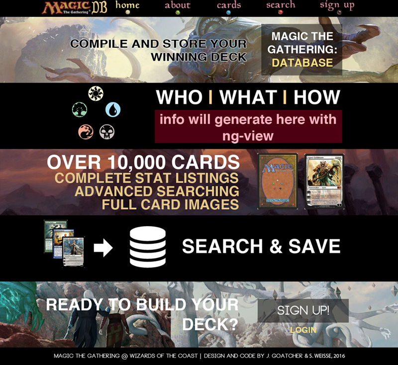

# project-3-MTG-MEANstack
A MEAN stack app about magic the gathering TEAM: Colt w/ jamesgoatcher

# Languages used:
HTML, CSS, Javascript, angular.js

# Synopsis
A deck building and card searching app for Magic: The Gathering using http://magicthegathering.io/

# Trello
Daily Tracker: https://trello.com/b/ssU9hOTS

# Potential MVP
- [ ] Site/App with page views: 
	- index
	- search
	- card show page
	- user home
	- user deck

- [ ] User Login/logout

- [ ] card search

# Wireframe

# Technologies Used (API Reference?)
node.js, express, html, css, mongodb, mongo, and mongoose, angular.js, http://magicthegathering.io/

# Approach

# Live Site Link

Soon......

#Installation Instructions
None at the moment

# Unsolved Problems
