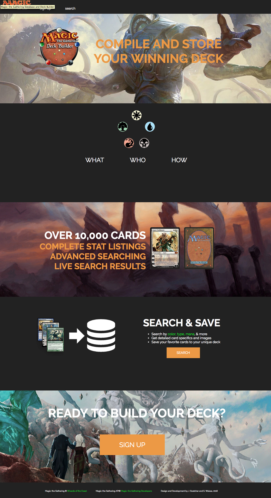
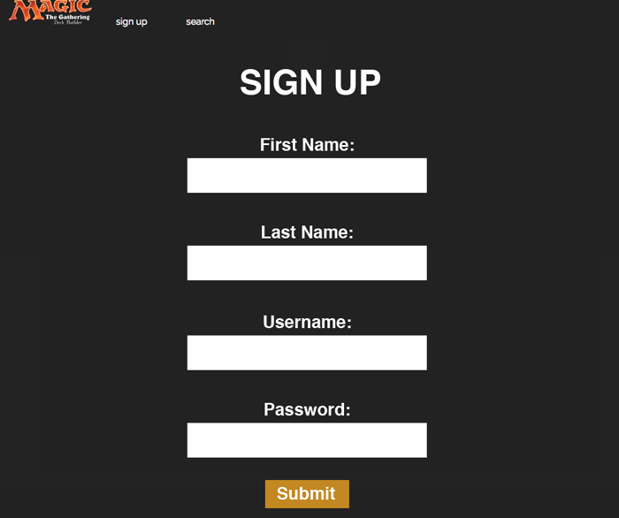
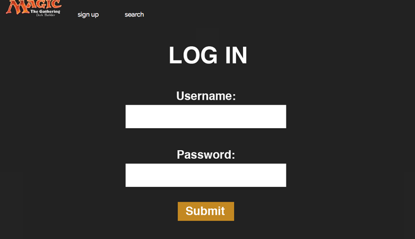
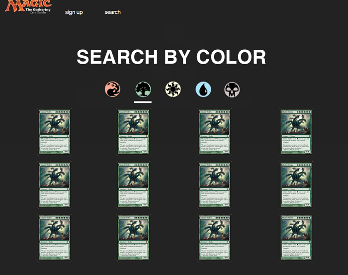
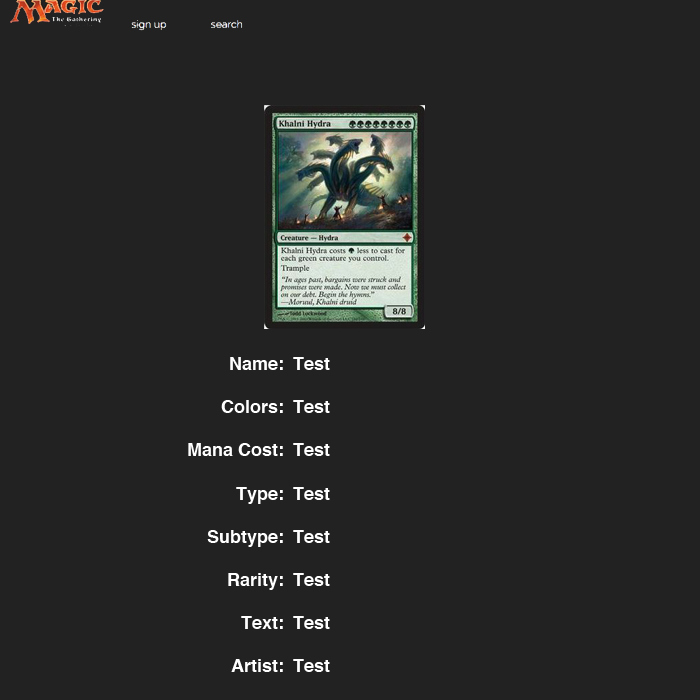
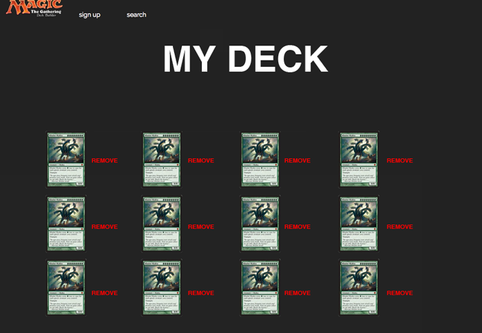

# project-3-MTG-MEANstack
A MEAN stack app about magic the gathering TEAM: Colt w/ jamesgoatcher

# Languages used:
HTML, CSS, Javascript, angular.js, express, mongoose/mongoDB

# Synopsis
A deck building and card searching app for Magic: The Gathering using http://magicthegathering.io/

# Trello
Daily Tracker: https://trello.com/b/ssU9hOTS
Project Flow Board: https://trello.com/b/IoQvFBzA/project-flow

# MVP
- [x] Site/App with page views: 
	- index
	- search
	- card show page
	- user home
	- user deck

- [x] User Login/logout

- [x] card search

# User Stories
- User will see home screen when they load the app
- User will be able to create a unique username and password
- Users will be able to sign into app
- Users will be able to log out of their session
- Users will be able to search

# Stretch Goals 
- User will be able to advance search by multiple variables
- User will be able to access a unique view for their activity with deck(s) they are building
- Users will be able to add a card to their "decks" (add card to a specific deck)
- Users who are not logged in can do simple and advanced searches but cannot add cards
- User can name decks
- User will be able to delete cards from deck
- User will be able to edit info about their deck (name, ...)
- User can delete deck(s)
- User can see some relevant analysis of the deck they've been building (mana curve, color distribution, suggested land count)

# Wireframe

# Technologies Used (API Reference?)
node.js, express, html, css, mongoDB, and mongoose, angular.js, http://magicthegathering.io/

# Approach
We created a MEAN stack app that connects the front end functionality of angular.js with the backend power of mongoDB and mongoose and express. A single page app with the power of angular and backed it up with a database in express and mongoDB. 

It creates users in the DB and can put them in or pull their info for signup or login. It searches an api (magic the gathering DB) for cards of certain color and then loads the results, saving a json for immediate retrieval of those colored cards (a new search replaces the json). If a user is logged in then  they can save a card to their deck and then the card can be called up from their deck which is stored in the DB.

# Live Site Link

https://magicdeckbuilder.herokuapp.com/

#Installation Instructions
None at the moment

# Unsolved Problems
- Our message about an empty deck still appears even after a card is added.
